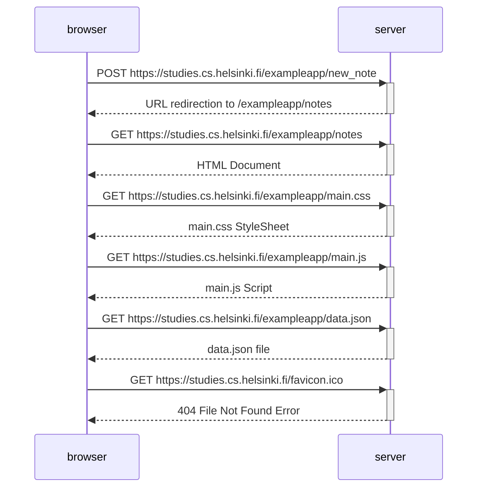

# New Note Diagram:

Situation where the user creates a new note

```mermaid
sequenceDiagram
    participant browser
    participant server

    browser->>+server: POST https://studies.cs.helsinki.fi/exampleapp/new_note
    server-->>-browser: URL redirection to /exampleapp/notes

    browser->>+server: GET https://studies.cs.helsinki.fi/exampleapp/notes
    server-->>-browser: HTML Document

    browser->>+server: GET https://studies.cs.helsinki.fi/exampleapp/main.css
    server-->>-browser: main.css StyleSheet

    browser->>+server: GET https://studies.cs.helsinki.fi/exampleapp/main.js
    server-->>-browser: main.js Script

    browser->>+server: GET https://studies.cs.helsinki.fi/exampleapp/data.json
    server-->>-browser: data.json file 

    browser->>+server: GET https://studies.cs.helsinki.fi/favicon.ico
    server -->>-browser: 404 File Not Found Error
```