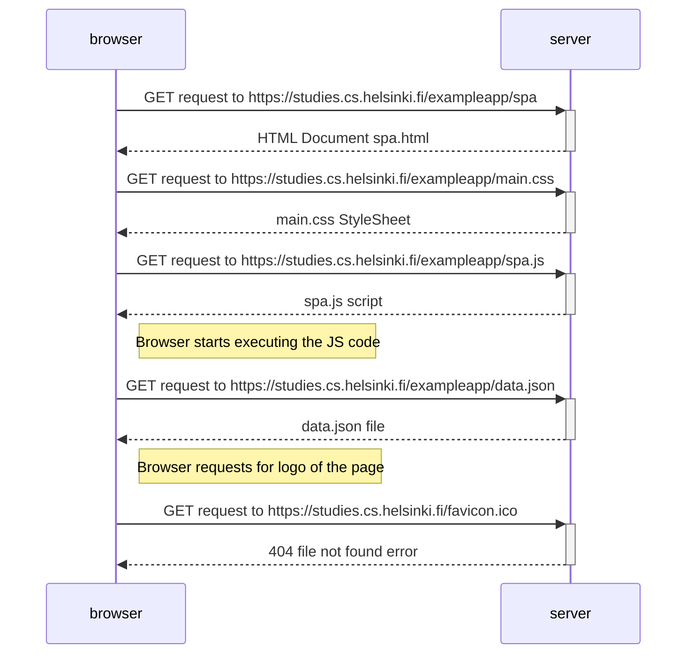

Single page app diagram

Situation where User visits the site

```mermaid
sequenceDiagram
    participant browser
    participant server

    browser->>+server: GET request to https://studies.cs.helsinki.fi/exampleapp/spa
    server-->>-browser: HTML Document spa.html

    browser->>+server: GET request to https://studies.cs.helsinki.fi/exampleapp/main.css
    server-->>-browser: main.css StyleSheet 

    browser->>+server: GET request to https://studies.cs.helsinki.fi/exampleapp/spa.js
    server-->>-browser: spa.js script

    Note right of browser: Browser starts executing the JS code

    browser->>+server: GET request to https://studies.cs.helsinki.fi/exampleapp/data.json
    server-->>-browser: data.json file

    Note right of browser: Browser requests for logo of the page
    browser->>+server: GET request to https://studies.cs.helsinki.fi/favicon.ico
    server-->>-browser: 404 file not found error 
```