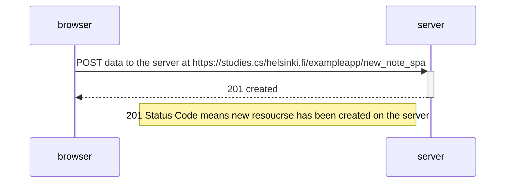

# New note in Single page app diagram

Situation where user creates a new note after already having loaded the page

```mermaid
sequenceDiagram
    participant browser
    participant server

    browser->>+server: POST data to the server at https://studies.cs/helsinki.fi/exampleapp/new_note_spa
    server-->>-browser: 201 created
    Note left of server: 201 Status Code means new resoucrse has been created on the server
```